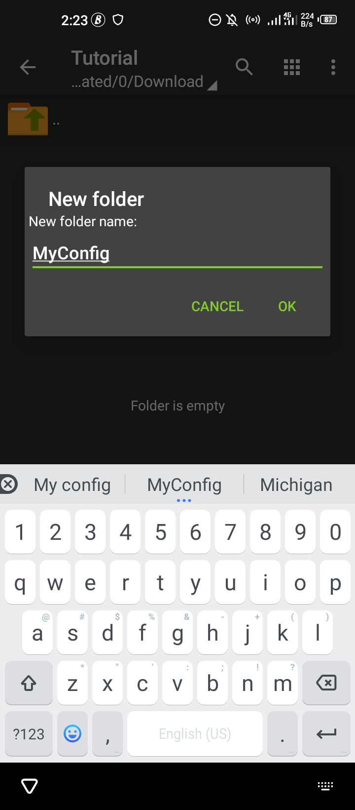
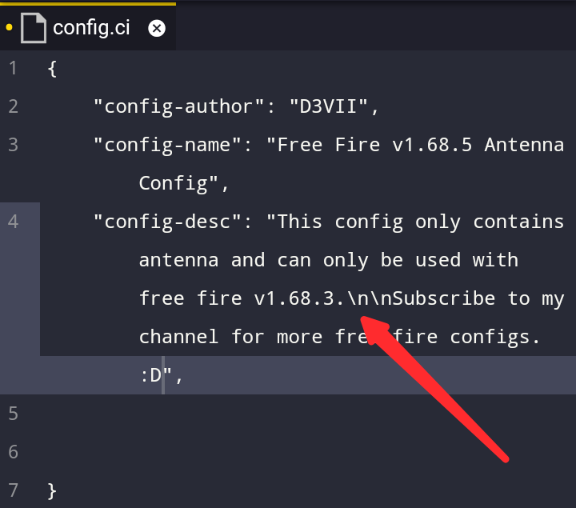
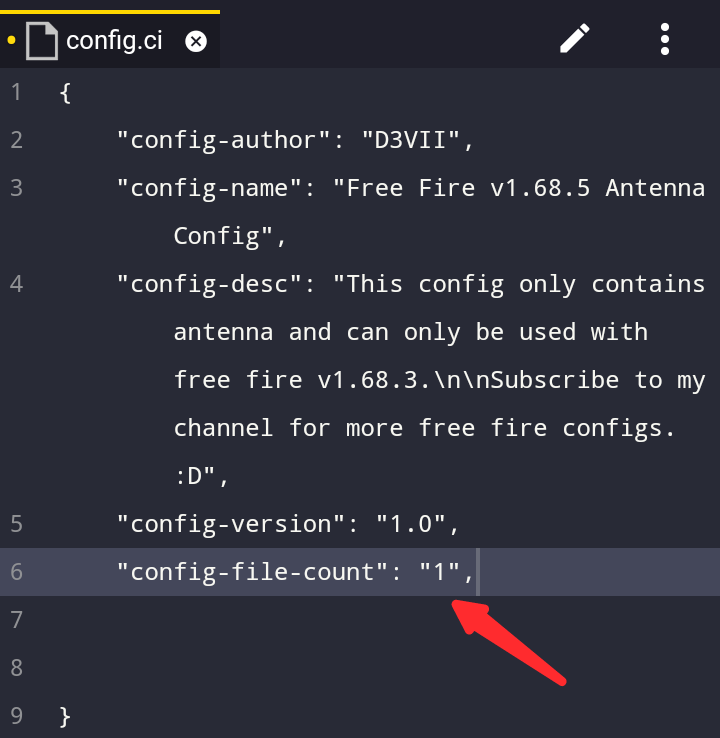
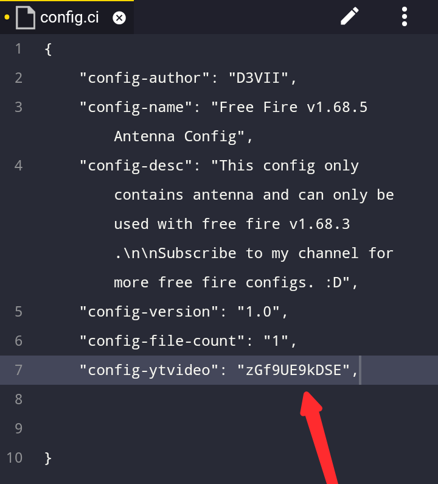
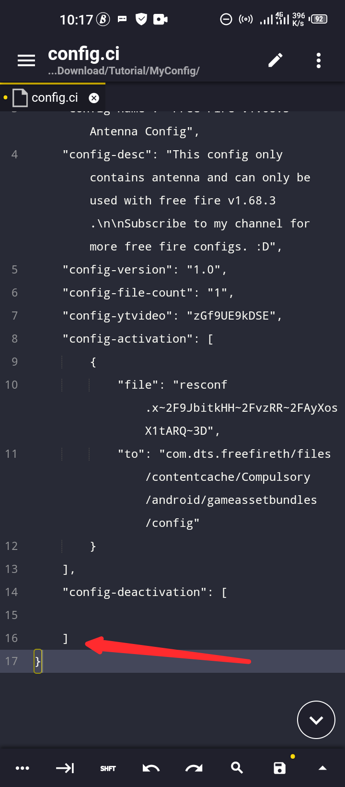
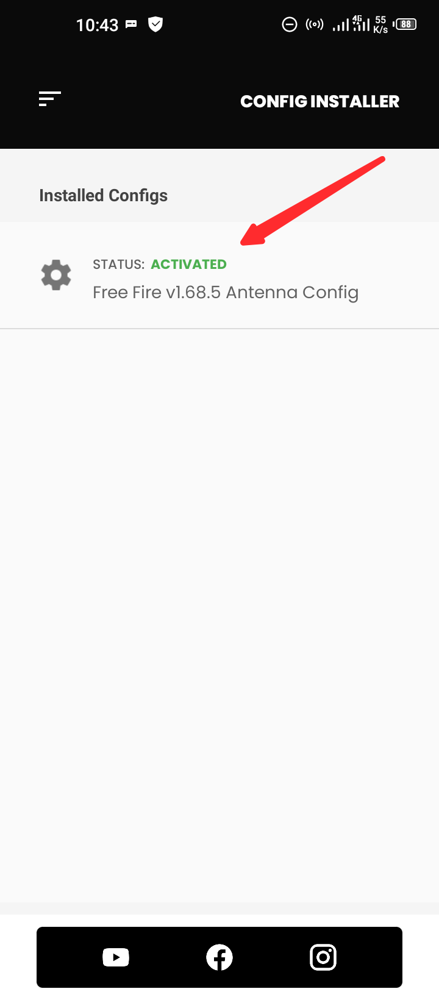

# Config Installer Documentation
Welcome to config installer documentation for config creators / developers.

> Please note that the things discussed here are not for config users, the things discussed here are only useful for config creators who want to learn how to make their configs compatible with config installer and allow their users easily install their configs.


Now let's get started...

The first thing to keep in mind is that Config Installer uses **JSON(Javascript Object Notation)** structure to understand how your configs will be installed based on how you tell it to. If you are familiar with **JSON** already then understanding this would be much easier for you. And if you are new to **JSON** syntax or structure then trust me its very easy to learn and understand.


Enough talking, let's do some interesting things.


### Step 1: Getting a text editor & file manager
----

The first thing you need is a good text editor and file manager, if you have a text editor and file manager already then feel free to skip this step.

You can use whatever text editor or file manager of your choice but this are the ones I recommend: 

- [Acode Text Editor](https://play.google.com/store/apps/details?id=com.foxdebug.acodefree)
- [ZArchiver File Manager](https://play.google.com/store/apps/details?id=ru.zdevs.zarchiver)


### Step 2: Structuring files and directories
----
Open **ZArchiver** or your prefered file manager and create a new folder. You can name the folder anything you want.



After creating the folder open it.


After opening the folder create a new folder inside the folder you created previously and name the folder **Activate**, this folder is extremely important so make sure you spell the name correctly and make sure the first letter **A** is in capital letter not **a**.

The activate folder is the folder **Config Installer** checks when installing your configs, you will learn more about it as we continue.


Now create one more folder and name this folder **Deactivate** it must also start with a Capital letter and make sure you spell it correctly to avoid errors.

> **Note:** do not create the **Deactivate** folder inside the **Activate** folder, make sure you create it inside the folded you created the **Activate** folder.


The last thing we need to do now before moving to the next step is to create the config file. The config file is what **Config Installer** uses to carry out the instructions you tell it to do. More on that later.


To create a config file is easy simply create a text file and name it whatever you want but make sure you put **.ci** at the end of the file name so that **Config Installer** can recognize the file and parse it.

The config file should be in the same folder you created your **Activate** and **Deactivate** folder.


### Step 3: File placement
----

If you made it this far then good job, you are almost done.

Time for put files into our **Activate** and **Deactivate** folder.

The type of files you put into your **Activate** and **Deactivate** folders depends on the type of config you are making.

Now let's imagine I am making a free fire config that modifies free fire **resconf** file which is located inside the **com.dts.freefireth** folder.


The first thing I need to do before I modify this file is to copy the original **"reaconf"** file from the free fire **com.dts.freefireth** folder and paste it in the **Deactivate** folder we created earlier.

> **Note:** whenever you are modifying any file from your free fire **com.dts.freefireth** folder always copy the original/non modified version of that file inside the **Deactivate** folder.  So that the **Config Installer** app can use that file to restore the changes you made if your config users want to deactivate your config from the **Config Installer** app.


But in my case I am only modifying the **resconf** file so I will copy the original file added by free fire into my **Deactivate** folder.


Next thing is to modify your **resconf** file and add whatever features you want to it. In my modified **resconf** file I added only antenna to it. After modifying the **resconf** file you need to copy and paste the modified **resconf** file inside your **Activate** folder like below.


Once you finish that now its time to proceed to the final step.


### Step 4: Editing the .ci config file
----

Now open the .ci file we created earlier with any text editor of your choice, I prefer [Acode Text Editor](https://play.google.com/store/apps/details?id=com.foxdebug.acodefree) so I'm going to use that to open my .ci config file.


Now that I have my config file opened it's time to edit it so that the **Config Installer** app can easily install your configs.

Let's start by adding a opening and closing curly bracets like this **{}** to our file.


You can also add spaces between them like below.


Now let's add a **CONFIG TAG**, config tags are used to give hold informations about your config so that the **Config Installer** app can display those informations when your users want to install your configs.

Currently there are: **8 Config Tags** available in config installer version 1.0, there is a possibility more config tags may be removed or added in the future.

> **Note:** all 8 config tags must be added in your .ci config file and they should be valid otherwise your configs might not get installed.

Below is a list of all the config tags:

NAME  | INFO
config-author  | This tag is used to show the name of the config creator.
config-name  | This tag is used to show the name of the config.
config-desc  | This tag is used to show the description of the config.
config-version  | This tag is used to show the version of the config.
config-file-count  | This tag is used to show the file count for the config.
config-activation  | This tag is used to control how a config is activated.
config-deactivation  | This tag is used to control how a config is deactivated.
config-ytvideo  | This tag is used to link to the channel of the config creator.
---|---


Now i will be explaining the **CONFIG TAGS**  mentioned above.
----


```json
"config-author": "xxx"
```
The **config-author** tag will display whatever you write in the **xxx** section as the authors name. So in this tag you need to put your name where **xxx** is located and make sure you don't remove the double quote around it.


One important thing to note is that you should always add a comma (**,**) after each config tag you use until you reach the last config tag.


----


```json
"config-name": "xxx"
```

The tag above tells the **Config Installer** app what title or name to use for your config. All you need to do is enter your desired name or title in the **xxx** section and add a comma **,** at the end. Make sure the comma is added after the ending quotation mark. 


----


```json
"config-desc": "xxx"
```

The **config-desc** tag let's you provide more information about your config to your users.

For example you may want to tell your users about the list of things you added to your config, this tag lets you do that easily.



In the image above if you look carefully you would notice that I used **\n** inside the config-desc tag. What it simply does is that it helps to put the text you write after it on a new line.

Pressing and using enter key on your keyboard will cause an error and won't put your text on a new line so to do that simply use **\n** and if you want two new lines created use two **\n\n** you can use as many as you want depending on the amount of new lines you want to create. You can experiment with it to understand how it works.

----


```json
"config-version": "xxx"
```

The **config-version** tag let's your add a version system to your configs, this helps users to differentiate your newer configs from older configs.

To use this config tag simply add a number inside the **xxx** section. The number can either be a decimal number or a non decimal number it all depends on you. But make sure it's a number because, alphabets are not allowed in this tag.

You can use any of the examples below.


----


```json
"config-file-count": "xxx"
```
This is probably one of the most important tags you need to pay attention to when creating your **.ci** config file. The reason is because this tag is used to let **Config Installer** know how many files it needs to copy to during activation and deactivation of your config.

If your config uses 2 files or more then make sure you enter the amount of files the config uses in the **xxx** section. If you fail to add the correct file count then the installer might give unexpected errors or results during installation.

My config only needs 1 file to work so I will put **1** in the **xxx** section like below.



----


```json
"config-ytvideo": "xxx"
```

This tag is where you put the ID of your YT video, you can put the ID of the video that you created for the config.

The video ID you put must be a youtube video ID and the video needs to be set to public.

Here is an example on how to use this tag, lets imagine this is the url to your youtube video **https://youtu.be/zGf9UE9kDSE**

All you need to do is copy the video ID after after the forward slash.

https://youtu.be/ **zGf9UE9kDSE**

The part highlighted in bold above is your youtube video ID, all you need to do is copy this ID and paste it in the **xxx** section of the **config-ytvideo** config tag.

See example below.



----


```json
"config-activation": [xxx]
```

Time for us to talk about another important config tag, this tag is used to tell the **Config Installer** app where it should put the files in your activation folder.

Now let's take a look at how we can use this tag.

Firstly we begin by adding opening and closing curly brackets inside the **xxx** section.

Example:


```json
"config-activation": [
    {
    
    }
]
```

The **config-activation** tag consists of **Sub Tags** this sub tags are tags that can only be used inside another tag. They are not part of the **Main Tags**.

The **config-activation** tag consists of the following **Sub Tags**

SUB TAG NAME  | SUB TAG DESCRIPTION
"file"  | This tag is used to select a file from the **Activate** folder.
"to"  | This tag is used to specify a location where the selected file will be copied.
---|---

Both the **file** and **to** sub tags work hand in hand with each other let's look at an example on how we can use them.

```json
"config-activation": [
    {
        "file": "file full name",
        "to": "location to copy file to"
    }
]
```

In the **file** sub tag you need to specify the name of a file from your activation folder while in the **to** sub tag you need to specify the location where the file you specified in the **file** sub tag will be copied to.

Let's look at how we are going to apply this sub tags in the test project I am building.

First let's navigate to our **Activate** folder and copy our file name.


After copying our file name let's paste it inside our **file** sub tag inside **config-activation** tag.


Next is to find the file director where we want the file to be copied to. Once we have this director we paste it in our **to** sub tag.

To find this directory we can use our file manager to copy it. Navigate to any folder inside free fire **com.dts.freefireth** data folder where you want your activation files to be copied to.

For my test project I will be copying my config into the config folder located inside free fire **com.dts.freefireth** data folder.


Unfortunately [ZArchiver File Manager](https://play.google.com/store/apps/details?id=ru.zdevs.zarchiver) can not copy file/folder paths so you will have to to write it yourself or use a different file manager that let's you copy file/folder paths.

Now that we have our file path let's paste it in our **to** sub tag.


> Make sure your file path always starts from the **com.dts.freefireth** folder and ends with the name of the folder you want to copy it to.

If the number of files you want **Config Installer** to copy from the **Activate** folder to free fire data folder is more than one then you simply repeat the same process above, let me show you an example.

Firstly add a comma(**,**) after the closing curly bracket inside the **config-activation** tag.


Then repeat the same **Sub Tags** we created earlier.

Example:


I will be removing the new addition because my test config only requires one file not two.


----


```json
"config-deactivation": [xxx]
```

We have gotten to the last **Config Tag**, this tags is also very important. If you fail to use this tag properly then the **Config Installer** app will fail to install your config properly.

This tag is similar to the **config-activation** tag which we discussed earlier. They are like identical twins, they both use the same **Sub Tags** which is the **file** and **to** sub tags.

The difference between the two of them is that the **config-activation** tag will only check and use the files in the **Activate** folder while the **config-deactivation** tag only check and uses the files inside the **Deactivate** folder.


I'm not going to explain much about the **config-deactivation** tag because it works similarly to the **config-activation** tag so what you could do is just copy the things inside the **config-activation** tag and paste them in the **config-deactivation** tag.

Firstly remember to add a comma (**,**) at the end of the **config-activation** tag.


Now lets add the **config-deactivation** tag.




> **NOTE:** once you reach the last tag you no longer need to add a comma (**,**) at the end of the tag.


Now we just need to copy some parts of our **config-activation** tag into our **config-deactivation** tag.


Now we are done building our **.ci** config file, all that is left is to save our changes and test it with the **Config Installer** app.


### Step 5: Testing and zipping our config

Now let's test our config to see if it works as expected.


Firstly open the **Config Installer** app.
Click the **Install Config** button.


Click the **+** icon to select a config, once the file picker opens up navigate to the folder where your **.ci** file is located then click on the **.ci** file and click **SELECT** at the bottom of the picker.


Once the file is selected a button will appear below it, click on the button to install the config.


After clicking on the button, if you where successfully redirected back to the main page then it means your config was installed successfully.

You will now see your config name and it's status there. By default all newly installed configs will be deactivated so you have to activate it first before it work.

To activate, click on the config.


After that you will be taken to the next page, on this page you will see your config information and the thumbnail of the YouTube video you linked to your config. If the thumbnail is clicked it will automatically redirect users to your video.

Now click the activate button to activate your config.


Once config is activated you will be redirected back to the main page and your config status will change from **Deactivated** to **Activated**



Next click on the 3 lines on the top left of the screen. 


It will open up a menu, from the menu click on **Free Fire** to open free fire and see if your config works.


Here is proof that mine works.


Next week test the deactivate button to see if our config is deactivated.

Close your free fire app and go back to the **Config Installer** app, after that click on your config.

Click on the **Deactivate** button.


Open free fire and see if your config is deactivated.

Here is proof mine got deactivated.


----


When you are ready to share your config to your users then go to the folder where your .ci file is located.


Click back button to go outside the folder.


Now that you are outside the folder let us zip the folder. Make sure the folder you are zipping contains the **Activate** folder, **Deactivate** folder and the **.ci** config file.

You can choose whatever compression format you want, not necessarily you choose zip, you could compress it as rar or 7z.


After the folder is zipped, upload the zip file and share to your users.

Tell them to download the **Config Installer** app and explain to them how to install it. The installation process is the same as the one explained above.


### Templates
----
Here are some ready to use templates I created for you all, you can copy and paste this templates and use them as you wish but remember to change the details / information in all the tags.

But I recommend you try creating yours, this helps you understand things better.

### Template for 1 config file


```json
{
    "config-author": "Your Name Here",
    "config-name": "Your Config Name Here",
    "config-desc": "Your Config Description Here\n\nThis Will Appear On A New Line.",
    "config-version": "Config Version Here Example: v1.0",
    "config-file-count": "1",
    "config-ytvideo": "Your Config YT Video ID Here Example: zGf9UE9kDSE",
    "config-activation": [
        {
            "file": "Your Config File Name From The Activate Folder",
            "to": "com.dts.freefireth/files/contentcache/Compulsory/android/gameassetbundles/config"
        }
    ],
    "config-deactivation": [
        {
            "file": "Your Config File Name From The Deactivate Folder",
            "to": "com.dts.freefireth/files/contentcache/Compulsory/android/gameassetbundles/config"
        }
    ]
}
```

### Template for 2 config file


```json
{
    "config-author": "Your Name Here",
    "config-name": "Your Config Name Here",
    "config-desc": "Your Config Description Here\n\nThis Will Appear On A New Line.",
    "config-version": "Config Version Here Example: v1.0",
    "config-file-count": "1",
    "config-ytvideo": "Your Config YT Video ID Here Example: zGf9UE9kDSE",
    "config-activation": [
        {
            "file": "Your Config File 1 Name From The Activate Folder",
            "to": "com.dts.freefireth/files/contentcache/Compulsory/android/gameassetbundles/config"
        },
        {
            "file": "Your Config File 2 Name From The Activate Folder",
            "to": "com.dts.freefireth/files/contentcache/Compulsory/android/gameassetbundles/config"
        }
    ],
    "config-deactivation": [
        {
            "file": "Your Config File 1 Name From The Deactivate Folder",
            "to": "com.dts.freefireth/files/contentcache/Compulsory/android/gameassetbundles/config"
        },
        {
            "file": "Your Config File 2 Name From The Activate Folder",
            "to": "com.dts.freefireth/files/contentcache/Compulsory/android/gameassetbundles/config"
        }
    ]
}
```


You can also click the link below to download my test project so you can study it and use it to make your own config file that is compatible with the **Config Installer** app.

https://drive.google.com/file/d/186H93yYl8afG9jIkACmPO6C795aNWf3O/view?usp=drivesdk

----


Thank you so much for your time, if you have any more questions or need video tutorials you can subscribe to my YouTube channel or message me on any of the social platforms bellow.

- [D3VII YouTube Channel](https://youtube.com/channel/UCqBtWt9bNrhVAz2FRbv4-CQ)

- [D3VII Facebook Account](https://facebook.com/devtitaro)

- [D3VII Instagram Account](https://www.instagram.com/devtitaro/)

